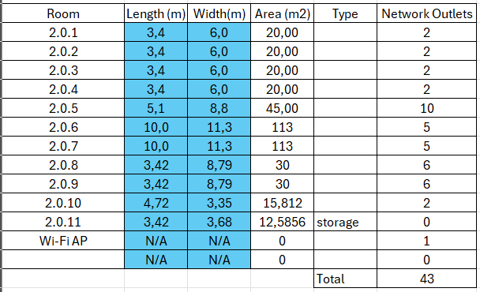
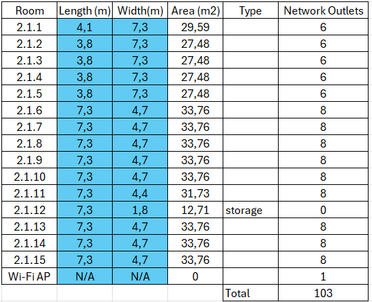

RCOMP 2022-2023 Project - Sprint 1 - Member 1200657 folder
===========================================
(This folder is to be created/edited by the team member 1200657 only)

# Building 2

## Index

1. [Rooms Area Measurement and Standard nº of Network Outlets](#markdown-header-1-rooms-area-measurement-and-standard-nº-of-network-outlets)

2. [Deployment Schematic Plans](#markdown-header-2-deployment-schematic-plans)

   2.1. [Ground Floor Schematics](#markdown-header-21-ground-floor-schematic-(cross-connects-and-outlets))

   2.2. [First Floor Schematics](#markdown-header-22-first-floor-schematic-(cross-connects-and-outlets))

## 1. Rooms Area Measurement and Standard nº of Network Outlets

### Ground Floor

### Floor One

### Building 2 Total Usable Area and Outlets

| Division      | Usable Area (m^2) | Nº Network Outlets |
|---------------|-------------------|--------------------|
| Ground Floor  | 439.40            | 43                 |
| First Floor   | 454.01            | 103                |
| **TOTAL**     | 893.41            | 146                |

# 2. Deployment Schematic Plans

 2.1. Ground Floor Schematic (cross-connects and outlets)

## 2.2. First Floor Schematic (cross-connects and outlets)

